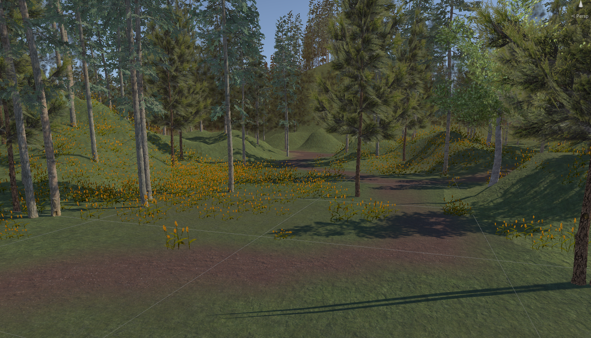
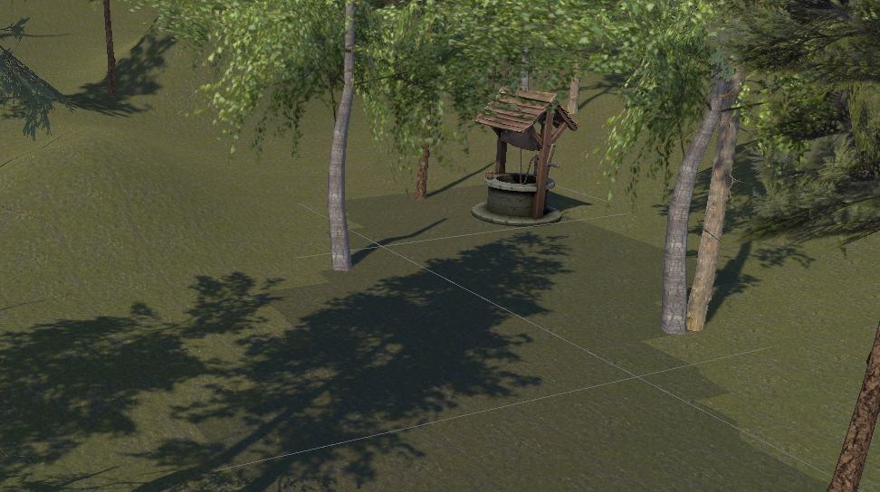
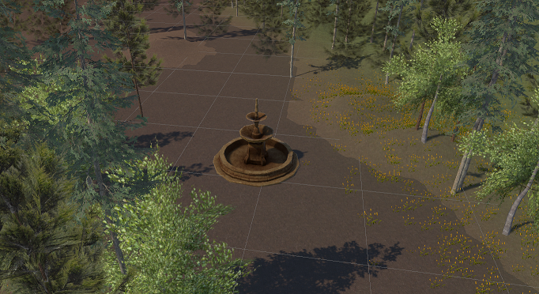
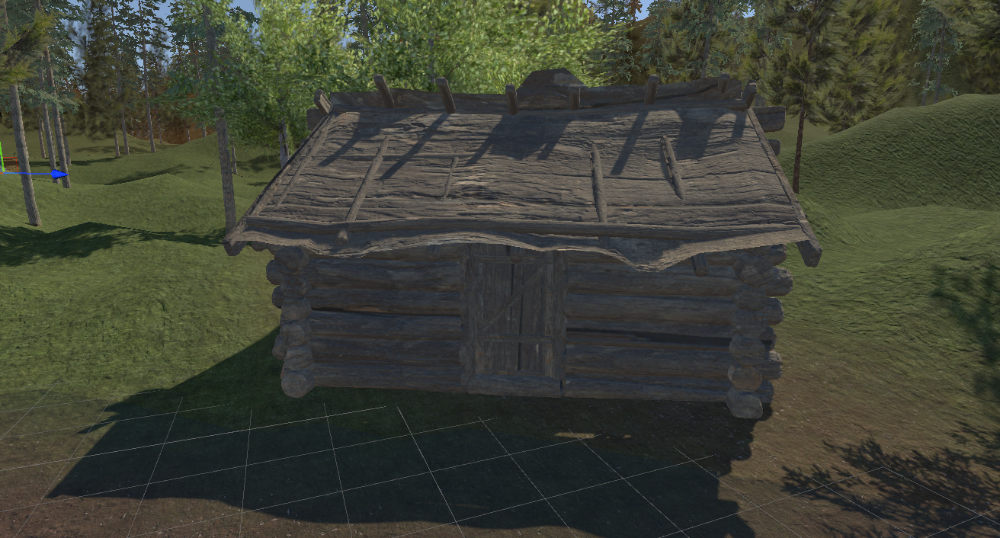
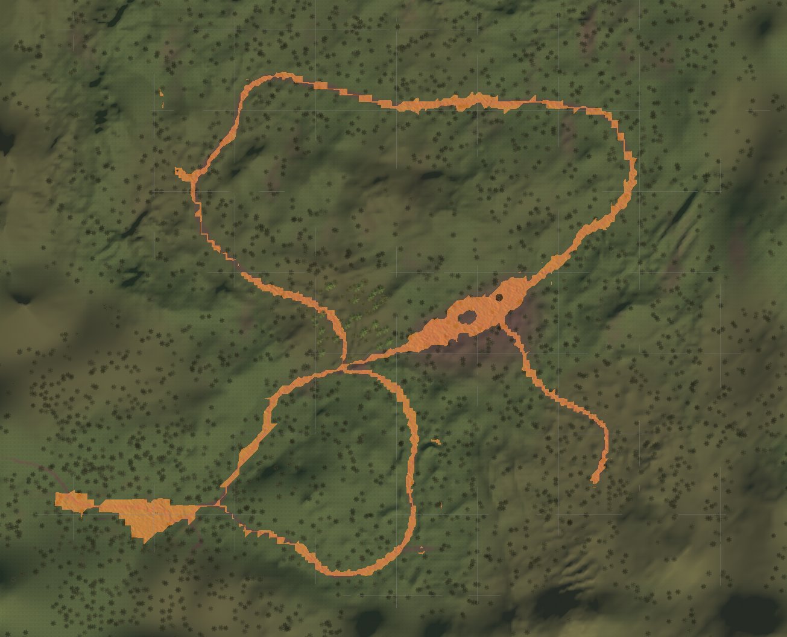

# VR-Forest
A Virtual Reality game/scenario in a realistic forest, exploration with teletransportation. 

## Result

## Special Assets

## Walkable path

## Requirements
- Unity 2021.2

## Run
Execute the project with Unity

## Authors
* **Igor Lirussi** @ BOUN Boğaziçi University - BuViar Lab
* **İpek Paksoy** @ BOUN Boğaziçi University - BuViar Lab

## License
This project is licensed under License - see the [LICENSE.md](LICENSE.md) file for details
